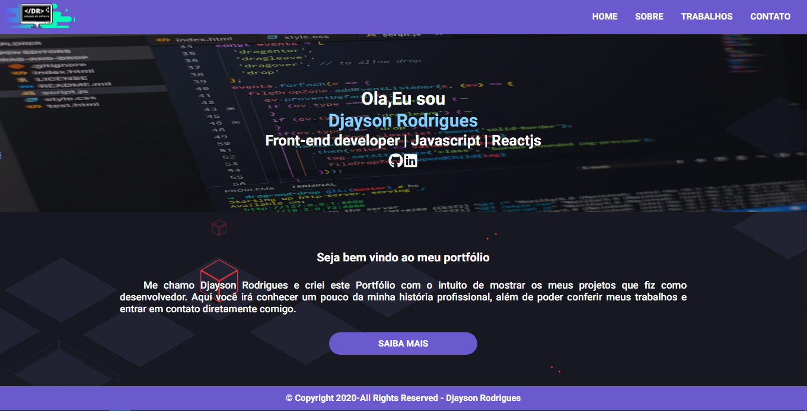

<p align="center"></img>
<h1 align="center">Projeto Portfólio</h1>
<p align="center">O projeto foi desenvolvido para desmostra meus trablhos de desenvolvedor</p>

<<<<<<< HEAD
 
## Instalação 
Para instalar as dependências e executar o **Reactjs-portifolio** você vai precisa do yarn instalado em sua máquina, o outro passo é você clona o projeto em seu computador e em seguida execute:
=======
  ## Instalação 
Para instalar as dependências e executar o **Reactjs-portifolio** (modo desenvolvimento), clone o projeto em seu computador e em seguida execute:
>>>>>>> 9ed7b462015a938a8e9b1b4a72a5857fce4d10f1

```bash
cd Reactjs-portifolio
yarn install
yarn start
```
## Autor
**Djayson Rodrigues** - [LinkedIn](https://br.linkedin.com/in/djaysonrodrigues)


## Frontend

</img>

## Licença
[MIT](./LICENSE)